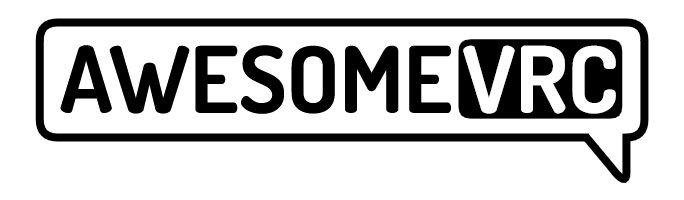
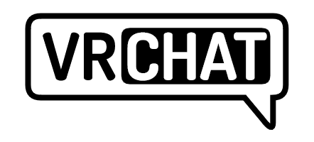

  

  # 🎮 Awesome VRChat JP 🗾
  
  
  
  

  VRChatの厳選リソース集 | 日本ユーザーに特化

  
  # 🚧🚧 UNDER CONSTRUCTION!! 🚧🚧
  **このリストは絶賛開発中！良さげな提案待ってます！**
  

## 📑 目次

クリックして展開

- [🏠 公式リソース](#公式リソース)
- [🎮 VR体験向上ツール](#vr体験向上ツール)
- [🛠️ 開発ツール](#開発ツール)
- [🎪 イベント](#イベント)
- [📚 ドキュメント](#ドキュメント)

## 💡 凡例
-  無料で利用可能なソフトウェア・リソース
-  無料で利用可能(寄付歓迎)
-  有料のソフトウェア・リソース

## 🏠 公式リソース

| リソース | 説明 | 💰 |
|----------|------|-----|
| [🌐 VRChat](https://vrchat.com/) | VRChat公式サイト |  |
| [📖 VRChat Documentation](https://docs.vrchat.com/) | 公式ドキュメント(英語) |  |

## 🎮 VR体験向上ツール
### 🔧 Quest-PCVR向け
| ツール名 | 説明 | 特徴 | 💰 |
|----------|------|------|-----|
| [Virtual Desktop](https://www.vrdesktop.net/) | PCVRをワイヤレスで | 低遅延、高機能 |  |
| [Air Link](https://www.meta.com/ja-jp/help/quest/articles/headsets-and-accessories/using-your-headset/connect-with-air-link/) | Meta公式ワイヤレスPCVR | Quest標準機能 |  |

### 🖥️ SteamVR拡張
| ツール名 | 説明 | 特徴 | 💰 |
|----------|------|------|-----|
| [OVR Advanced Settings](https://store.steampowered.com/app/1009850/OVR_Advanced_Settings/) | VR空間調整ツール | プレイスペース調整、モーション設定 |   |
| [OyasumiVR](https://store.steampowered.com/app/2538150/OyasumiVR__VR_Sleeping_Utilities/) | VR睡眠支援ツール | 自動シャットダウン、姿勢監視 |   |
| [fpsVR](https://store.steampowered.com/app/908520/fpsVR/) | VRパフォーマンスモニター | フレームレート監視、システム情報表示 |  |

## 🛠️ 改変・開発ツール
### ⚙️ 基本ツール
| ツール名 | 説明 | プラットフォーム | 💰 |
|----------|------|-----------------|-----|
| [ALCOM](https://vrc-get.anatawa12.com/ja/alcom/) | VCCのオープンソース代替 | Win/Mac/Linux |  |
| [Unity Hub](https://unity.com/ja/download) | Unityエディター管理ツール | Win/Mac/Linux |  |
| [VRC Avatar Explorer](https://booth.pm/ja/items/6372968) | アバター・アセット管理ツール | アバターや衣装の管理・整理が簡単 |   |

### 🤖 アバター向け
| ツール名 | 説明 | 特徴 | 💰 |
|----------|------|------|-----|
| [Modular Avatar](https://modular-avatar.nadena.dev/) | アバター改変支援ツール | 簡単な衣装着せ替え、高度なカスタマイズ機能 |  |
| [VRM Converter](https://pokemori.booth.pm/items/1025226) | VRM変換ツール | Unityエディターの拡張として動作 |   |
| [lilToon](https://lilxyzw.github.io/lilToon/) | 高機能シェーダー | 多くの人気アバターで使用 |   |
| [FaceEmo](https://booth.pm/ja/items/4915091) | 表情作成・設定ツール | より幅広い表情管理が容易に。|   |

### 🌍 ワールド向け
| ツール名 | 説明 | 特徴 | 💰 |
|----------|------|------|-----|
| [iwaSync](https://booth.pm/ja/items/2666275) | 動画プレイヤー | 各種サイトに対応 |   |
| [YamaPlayer](https://github.com/koorimizuw/YamaPlayer) | 動画プレイヤー | リッチなUI |   |
| [QvPen](https://booth.pm/ja/items/1555789) | 定番ペンツール | コライダー対応、高機能 |   |
| [UdonSharp](https://github.com/vrchat-community/UdonSharp) | C#ライク開発言語 | 強力なワールドギミック作成 |  |

## 📚 ドキュメント
### 📱 Quest対応
| ドキュメント | 説明 |
|------------|------|
| [Quest Content Optimization](https://docs.vrchat.com/docs/quest-content-optimization) | Quest向け最適化ガイド（英語） |

---

  
  ### 🌟 コントリビューション大歓迎！
  
  
  
  このリストをより良くするための提案や追加は[Issue](https://github.com/26d0/awesome-vrchat-jp/issues)や
  [Pull Request](https://github.com/26d0/awesome-vrchat-jp/pulls)でお待ちしています！

